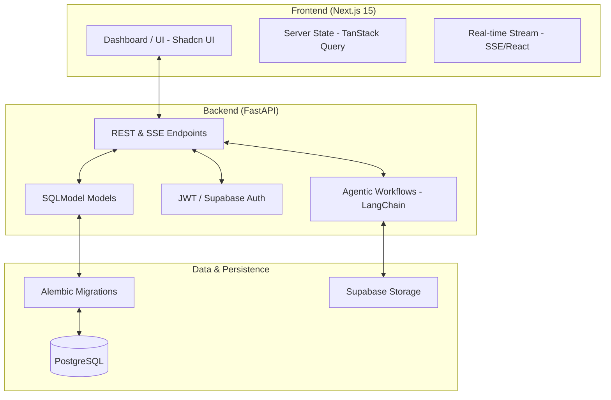

# GenEye — Technology Stack Specification

> **Phase:** Implementation Ready (Phase 3)
> **Rebuild Goal:** 100% Production-Grade Full-Stack (Next.js & FastAPI)

This document outlines the architectural components and technical stack selected for the GenEye platform rebuild, designed to handle the 72-table relational schema and real-time AI capabilities.

---

## 1. System Architecture



---

## 2. Component Specifications

### 2.1 Frontend: Next.js 15
*   **Framework**: Next.js (App Router) for hybrid Static/Server rendering.
*   **Styling**: Tailwind CSS for responsive, utility-first design.
*   **Components**: Shadcn UI (Radix UI based) for high-fidelity accessible components.
*   **Aesthetics**: Glassmorphic effects, Inter/Outfit typography, and vibrant HSL-based dark mode.
*   **Charts**: Recharts / Tremor for industrial and financial metric visualization.

### 2.2 Backend: FastAPI (Python 3.11+)
*   **Core**: FastAPI for high-concurrency async operations.
*   **Models**: SQLModel for unified data validation (Pydantic) and ORM (SQLAlchemy).
*   **Pumping Chat**: SSE (Server-Sent Events) for low-latency streaming of LLM tokens.
*   **Task Queue**: Celery / Redis for heavy background AI engineering tasks (ADLC).

### 2.3 Database & Cloud: PostgreSQL
*   **Engine**: PostgreSQL 16+ for relational integrity and JSONB support.
*   **Managed Service**: Supabase (Postgres, Auth, Edge Functions, Storage).
*   **Migrations**: Alembic for managing the **72-table schema evolution**.

### 2.4 AI Orchestration
*   **Providers**: Google (Gemini 2.5/3), OpenAI (GPT-4o/5), Anthropic (Claude 3.5).
*   **Logic**: LangChain/LangGraph for multi-agent autonomous development lifecycle (ADLC).
*   **Retrieval**: PGVector extension for RAG (Retrieval-Augmented Generation) in "Internal" chat mode.

---

## 3. Rationale for Stack Choice

1.  **Unified Schema**: SQLModel allows the **72 tables** we designed to be identical in Python, the Database, and the API documentation (Swagger).
2.  **Developer Velocity**: The synergy between Next.js and FastAPI is the fastest route to a production-grade enterprise SaaS today.
3.  **Real-Time UX**: SSE allows the GenEye Chat and Command Center to feel "alive," as tokens and metrics stream in without page refreshes.
4.  **AI Compatibility**: Python is the lingua franca of AI, granting native access to the widest array of models and machine learning libraries.

---

## 4. Initial Setup Commands

```bash
# Backend Setup
pip install fastapi[all] sqlmodel alembic psycopg2-binary langchain

# Frontend Setup
npx create-next-app@latest ./ --typescript --tailwind --eslint
npx shadcn-ui@latest init
```
